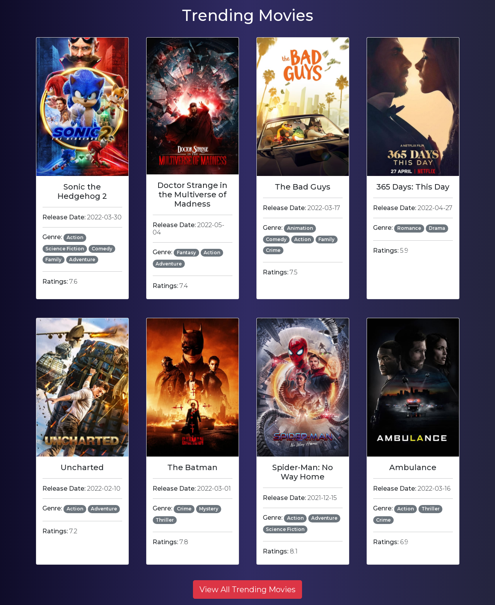
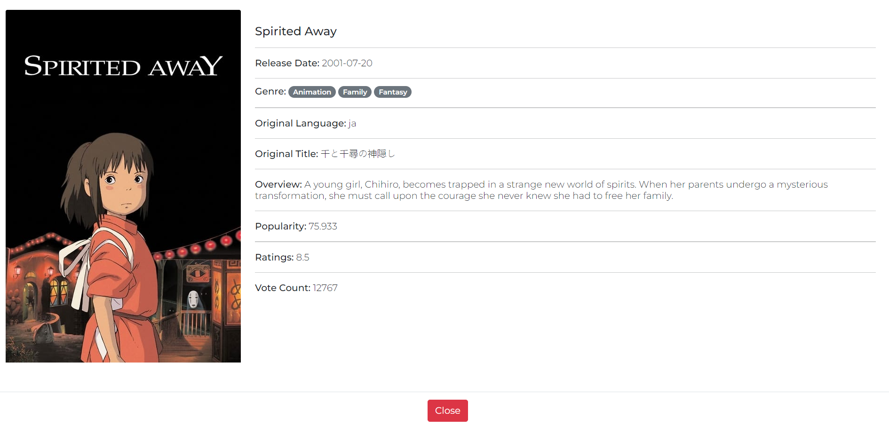
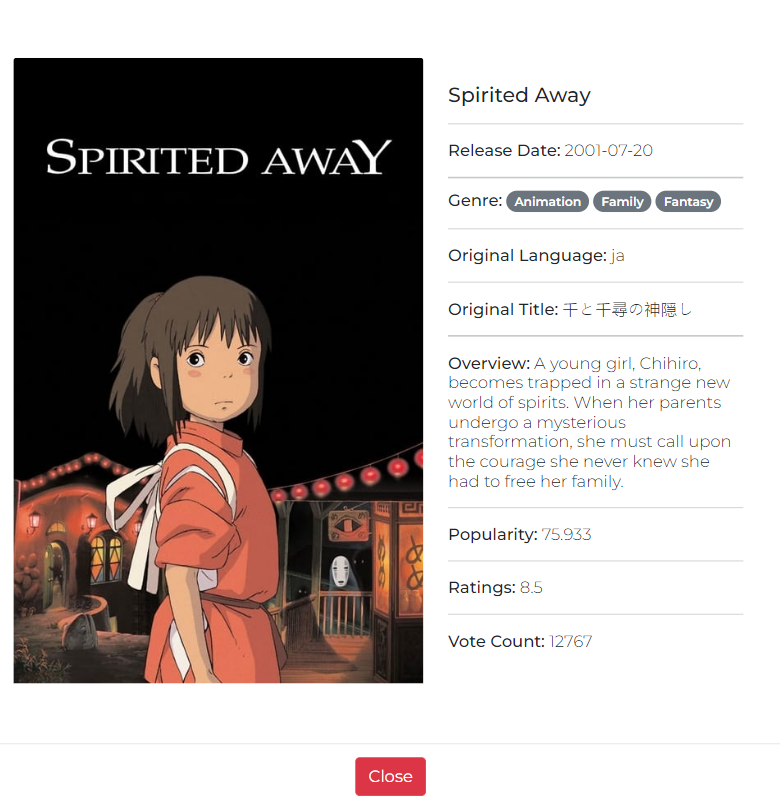
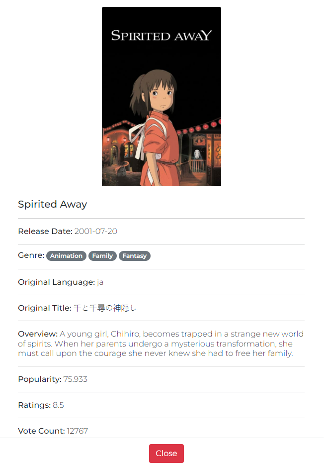

# kona-frontend

Live Site Link: [https://movie-search-portal.netlify.app/](https://movie-search-portal.netlify.app/)

---

## `Key Features:`

1. A responsive landing page that has 3 categories of movies, such:
    - trending movies
    - top rated movies
    - upcoming movies
2. In landing page each category of movies is a collection of eight movies with a *view all* button at the end.
3. Clicking on the *view all* button -
    - will redirect the user to a new page. 
    - contents of this page depends on the category the user has clicked upon.
5. User can view all the movies through pagination.
6. In that page each movie has -
    - a *Show Movie Details* button. 
    - by clicking this button user can see movie's detail information.
6. User can also search for movies within the current page.
7. User can search through movies based on these 4 filters:
    - *movie name*
    - *release year*
    - *overview*
    - *genre*

## `Front-End Technologies:`

- React
- Bootstrap 5
- Netlify

## `Project Architecture:`

This part of the doc resembles the whole coding flow of this repository. This project has 5 *components*, such:
1. [LandingPage](#showAllMovies)
2. [ShowEightMovies](#showEightMovies)
3. [SingleMovie](#singleMovie)
4. [MovieModal](#movieModal)
5. [ShowAllMovies](#showAllMovies)

---

### [LandingPage.js](./src/Components/LandingPage/LandingPage.js)  : 

This component's responsibility is to show 3 categorized movie's list on landing page. It calls one api for each of the category. Here -
- to fetch the *trending* movies, it calls the [trending movies api](#trendingMovies),
- to fetch the *top rated* movies, it calls the [top rated movies api](#topRatedMovies), and
- to fetch the *upcoming* movies, it calls the [upcoming movies api](#upcomingMovies)

All of the three categories consist 8 movies each. This is done by reusing [ShowEightMovies](#showEightMovies) component.

---

### [ShowEightMovies.js](./src/Components/ShowEightMovies/ShowEightMovies.js)  : 
This is a reusable component. It renders eight movies of a single category along with a *view all* button at the bottom. To render 8 movies it reuses [SingleMovie](#singleMovie) component. 

---

### [SingleMovie.js](./src/Components/SingleMovie/SingleMovie.js)  : 
This component is being reused in [ShowEightMovies](#showEightMovies) component, and [ShowAllMovies](#showAllMovies) component. This component's core responsibility is to design the view of every single movie card.
It does that with the help of *Card* component provided by react-bootstrap. Each card contains movie's poster, title, release date, genre and ratings. SingleMovie component reuses [MovieModal](#movieModal) component to deal with pop-ups. 

---

### [MovieModal.js](./src/Components/MovieModal/MovieModal.js)  : 
It renders react-bootstrap's *Modal* component to show movie details. The movie detail contains movie's title, release date, original language, original title, overview, popularity, ratings and view count. This modal only appears when the user clicks on *Show Movie Details* button.

---

### [ShowAllMovies.js](./src/Components/ShowAllMovies/ShowAllMovies.js)  : 
This component renders all the movies of a certain category. In this component, search filter and pagination is implemented. Users can view all the movies by pagination. Pagination is done with the help of a library called *react-paginate*.

For every time user paginates to a different page, one of the get movies api ([trending movies api](#trendingMovies) or [top rated movies api](#topRatedMovies) or [upcoming movies api](#upcomingMovies)) is being called with a query param such: `&page={{pageNumber}}`.

On the other hand, the search filter allows users to search through movies within a page. This searching can be done based on four filters such: movie name, release year, overview and genre. 

---

### [genre.js](./src/utility/genre.js) : 
This file contains two helper functions, such : 
1. `getGenreNameById(arr,id)` 
2. `getAllGenreNameByIdArray(arr,idArray)`

`arr` parameter for both of the functions is an array of objects, means each element of that array is an object. In this project `arr` will contain a list of genres. Each object of that array has a genre id and genre name.

The second parameter of `getGenreNameById` is `id`, which represents a single genre id. `getGenreNameById` function searches through list of genres for the given id, and returns genre name.

On the other hand, the second parameter of `getAllGenreNameByIdArray` function is an `idArray`, which represents an array of genre id's. This function searches through the list of genres for every single id given in `idArray`, and returns an array which has all the genre names corresponding to every id in `idArray`.

---

## `List of APIs:`

- get trending movies:  `https://api.themoviedb.org/3/trending/movie/day?api_key={{api}}`

- get top rated movies:  `https://api.themoviedb.org/3/movie/top_rated?api_key={{api}}`

- get upcoming movies:  `https://api.themoviedb.org/3/movie/upcoming?api_key={{api}}`

- get genre ids:  `https://api.themoviedb.org/3/genre/movie/list?api_key={{api}}&language=en-US`

- get poster image:  `https://image.tmdb.org/t/p/w500/{{imgUrl}}`

---

## `Screenshots:`

- Landing Page : Desktop
    
    

---

- Landing Page : Tablet
    
    

---

- Landing Page : Mobile
    
    

---

- All Top Rated : Desktop
    
    

---

- Movie Details : Desktop
    
    

---

- Movie Details : Tablet
    
    

---

- Movie Details : Mobile
    
    